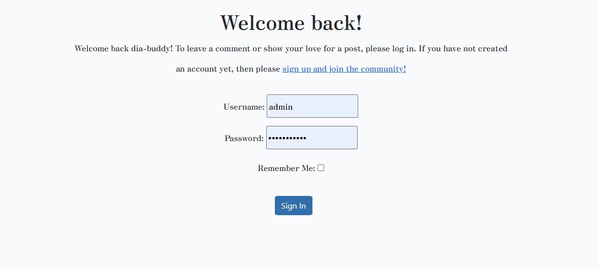
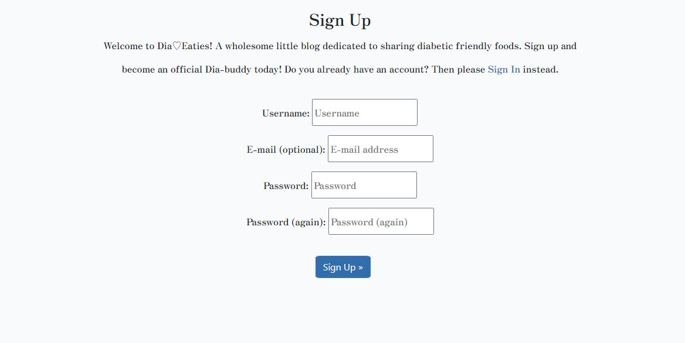
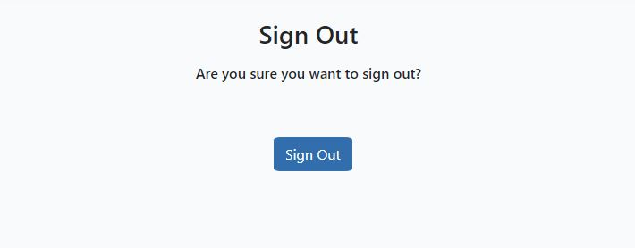
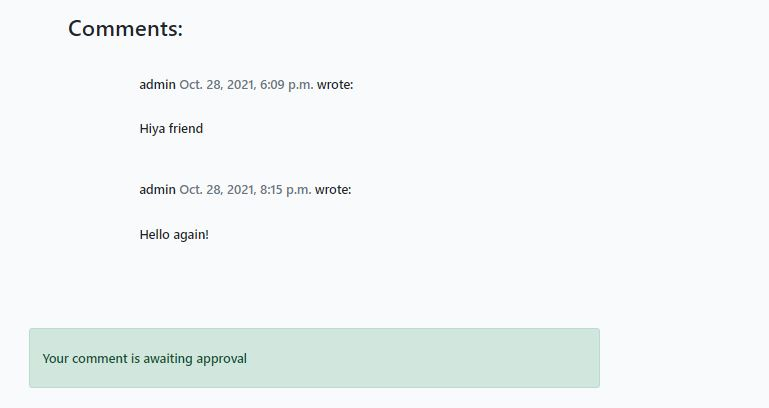
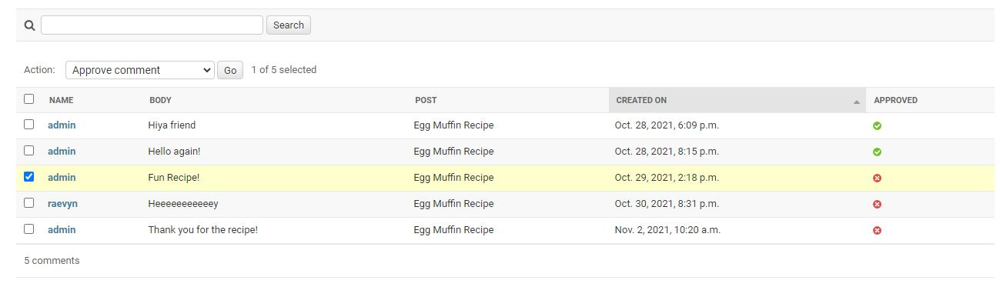
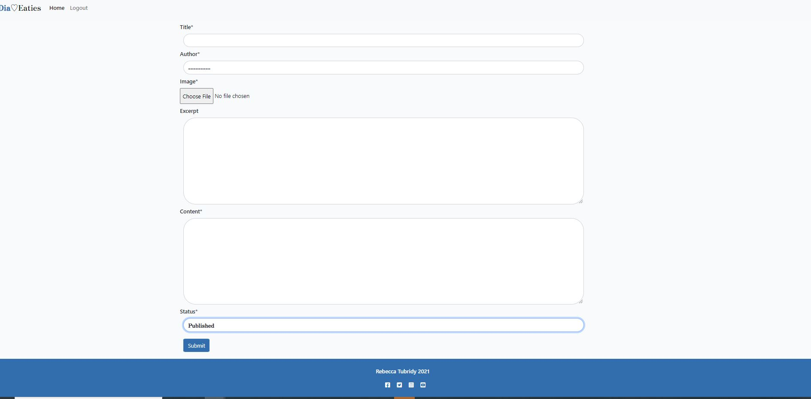
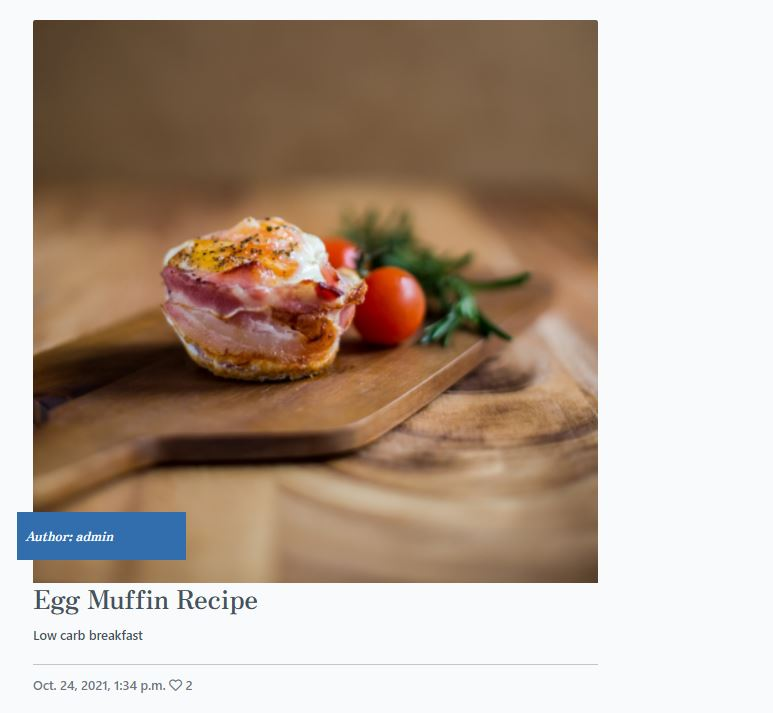
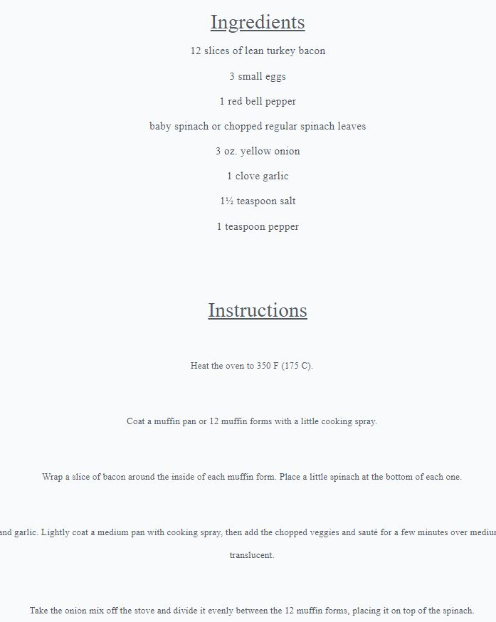
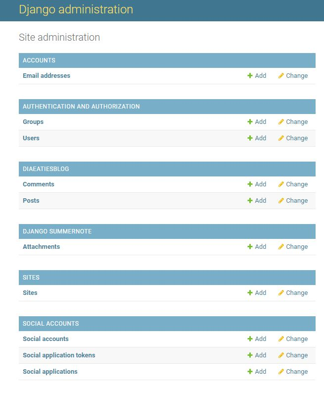
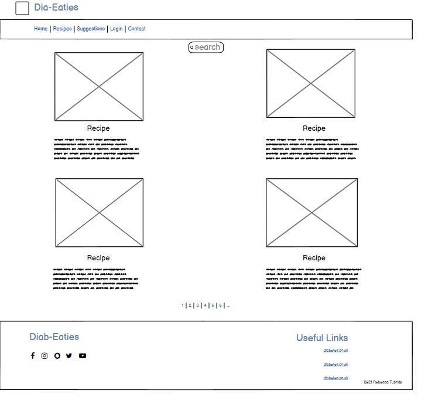

# Dia-Eaties Recipe blog
This project is a recipe blog dedicated to low carb and low sugar meals for diabetics, its very difficult to find suitable recipes for diet requirements in the vast sea of recipes online so I felt this site would be nice to have to have everything compiled into a singular space.

## Features
The blog features a number of interacvitiy for the user, it includes the option to
- register
- login
- logout
- create a recipe for logged in users
- like recipes
- leave comments

### User Account

- Login signout and registration 

 

### Comments

- Comments section 

- Comment approval 

### Create Recipe

- Create a recipe for registered users

### Like Function

- Like function for recipes 

### Created Recipe

- Created recipes are posted to homepage

### Admin Section
- Admin section

- Comment approval verfied 

 **Features left to add**

- I would like add more sections to split up the recipes e.g breakfast section, dinner section etc
- Add more interactivity for the users like a live comment feed 
- Add a more colouful or tasteful section for the ingredients and instructions part of the recipes
- Give the user an option to delete their recipes
- There are many things I would like to add in terms of functionality and the overall look

## Program Structure

- This is the original Wireframe for the Dia-Eaties recipe blog

- The final result has not changed much lading to the final project 
- The number of recipes has been decreased to three compared to the orginal four 
- and the registered user can now create their own posts instead of leaving a suggestion 

## Testing

 - I tested the admin approval for comments and recipes
 - I tested the sign in, register and signout process for the user and admin
 - Tested the basic functionality of the page. e.g the responsiveness 
 - I tested the process to allow a registered user to create a recipe and post it to the homepage
 - I tested comment approval within the admin section

### Errors

  - The main error I faced was missing module docsctring and class docstring
  - Another error was the line is too long error which again I could not use line break as it distrupted the code 
  - The errors in the code have not affected functinality

### Validator Testing 

- I used PEP8 to validate my python code
- I used https://validator.w3.org/ to validate html
- I used https://jigsaw.w3.org/css-validator/ to validate CSS
- I used https://jshint.com/ to validate Javascript
   

## Deployment 

- The game was deployed through Heroku 
  - I went on to the Heroku website 
  - Clicked on "Create-New-App"
  - Named my project and stated what region I live in
  - I clicked into settings 
  - Clicked into Deploy 
  - Connected to my GitHub
  - Searched for my project name repository and clicked connect
  - Enabled automatic deploys
  - Clicked "Deploy Branch" 

  The live links to my project are - 
   - https://8000-beige-grasshopper-kkfhy7ez.ws-eu17.gitpod.io/
   - https://diaeatiesblog.herokuapp.com/

## Acknowledgements

I want to thank my Fiance who kept pushing me to keep bettering myself and not letting me give up and for giving me advice on how to get the readme to sound more structured and professional.
Fellow students for letting me vent frustrations when I felt overwhelmed with the work.
Kasia who keeps up our morale and always checks to see if we are doing okay, she keeps us going through all of this. 

